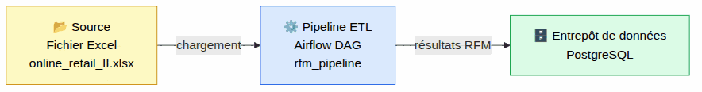
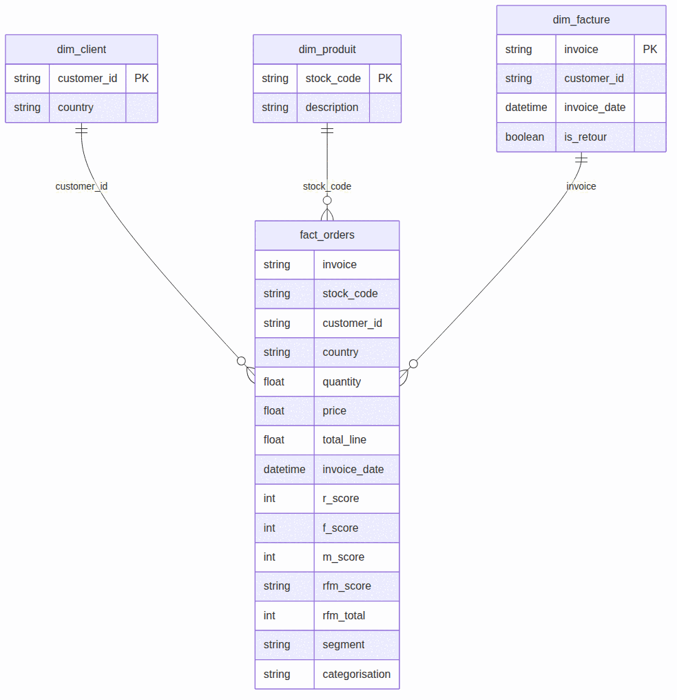
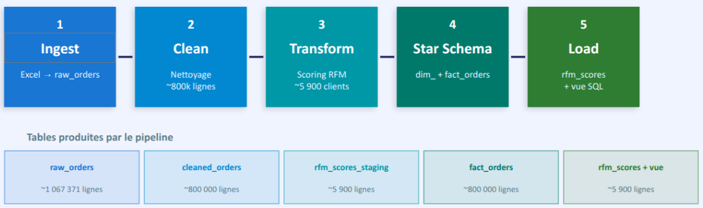
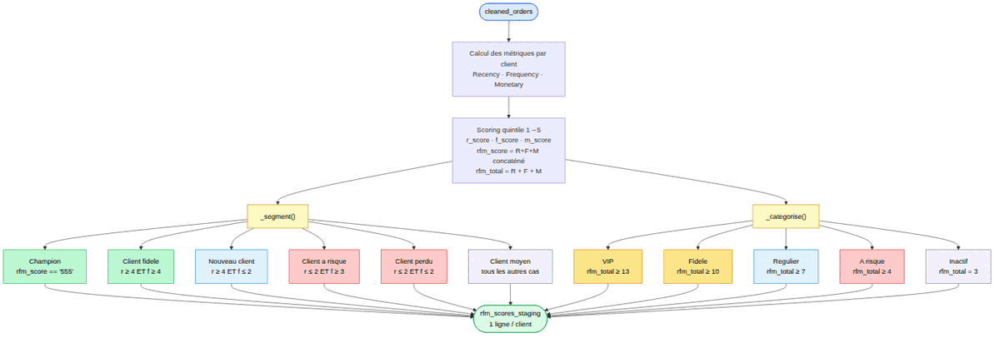
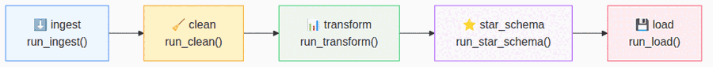
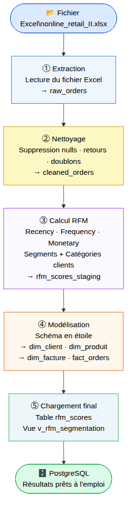

# brief-rfm-louveteaux-sauvages
Réalisé par : 
- Yohan 
- Hafida DJELTI 
- Kaouter RHAZLANI

## Contexte

Ce projet met en place une pipeline data RFM orchestrée avec Airflow, dockerisée avec Docker Compose, et exposée via Nginx.

L'application est en ligne avec :
- Airflow (UI/API) sur la racine `/`
- Streamlit sur `/doc/`


> **Source** : `dags/rfm_pipeline_dag.py`  
> **Stack** : Apache Airflow · PostgresHook · SQLAlchemy · Pandas  
> **Connexion** : `PostgresHook(postgres_conn_id="<ID_CONNECTION>")`

---

## Table des matières

1. [Architecture globale](#1-architecture-globale)
2. [Fonctions ETL](#2-fonctions-etl)
   - 2.1 [run_ingest — Extract](#21-run_ingest--extract)
   - 2.2 [run_clean — Clean](#22-run_clean--clean)
   - 2.3 [run_transform — RFM Scoring](#23-run_transform--rfm-scoring)
   - 2.4 [run_star_schema — Modèle dimensionnel](#24-run_star_schema--modèle-dimensionnel)
   - 2.5 [run_load — Persistance finale](#25-run_load--persistance-finale)
3. [Configuration du DAG](#3-configuration-du-dag)
4. [Tâches et ordonnancement](#4-tâches-et-ordonnancement)
5. [DAGs secondaires](#5-dags-secondaires)
6. [Lancer le pipeline](#6-lancer-le-pipeline)

---

## 1. Architecture globale

> Le projet part d'un fichier Excel de ventes brutes et le transforme, étape par étape, en un entrepôt de données structuré.
> Un orchestrateur (Airflow) pilote automatiquement 5 opérations dans l'ordre : charger, nettoyer, scorer, modéliser, puis exporter.
> Toutes les données transitent et aboutissent dans une base PostgreSQL organisée en zones distinctes.
> À la fin du pipeline, un dashboard Streamlit exploite les résultats pour visualiser les segments clients RFM.
> Ce schéma donne la vue d'ensemble : du fichier source jusqu'aux tables prêtes à l'emploi.

### Vue d'ensemble end-to-end

[](dag_img/dag_02_data_flow.png)

Le pipeline lit un fichier Excel, le nettoie, calcule les scores RFM, construit un schéma en étoile, puis expose les résultats via une table et une vue SQL. Toutes les tables sont dans la base de données


### Schéma en étoile

[](dag_img/dag_04_star_schema.png)

Au centre, `fact_orders` enregistre chaque ligne d'achat et est reliée à 3 tables de dimension : `dim_client` (qui a acheté), `dim_produit` (quoi) et `dim_facture` (quelle commande).
Les scores RFM sont joints directement sur `fact_orders`, ce qui permet de filtrer et analyser les comportements d'achat par segment client en une seule requête.
Les tables `rfm_scores` et la vue `v_rfm_segmentation` constituent la couche d'exposition finale, consommée par le dashboard.

---

## 2. Fonctions ETL

> Le pipeline est découpé en 5 fonctions Python, chacune responsable d'une étape précise du traitement.
> Ces fonctions sont définies directement dans le fichier du DAG — elles ne dépendent d'aucun module externe.
> Chaque fonction lit une table PostgreSQL produite par la précédente et écrit ses résultats dans une nouvelle table.
> Ce découpage garantit que chaque étape peut être relancée indépendamment en cas d'échec.
> Les détails techniques (code, colonnes, règles) sont décrits dans les sous-sections ci-dessous.

Les 5 fonctions Python sont définies dans `rfm_pipeline_dag.py` et appelées par les tâches Airflow. Elles n'utilisent pas les modules `dags/utils/` — la logique ETL est **entièrement inline**.

[](dag_img/dag_01_pipeline_2.png)
### Tables et objets produits

| Table / Vue              | Créée par       | Lignes (ordre de grandeur)  | Description                                          |
|--------------------------|-----------------|-----------------------------|------------------------------------------------------|
| `raw_orders`             | `ingest`        | ~1 067 371                  | Données brutes Excel, tout en TEXT                   |
| `cleaned_orders`         | `clean`         | ~800 000                    | Données nettoyées + colonne `total_price`            |
| `rfm_scores_staging`     | `transform`     | ~5 900 clients              | Scores RFM par client (table intermédiaire)          |
| `dim_client`             | `star_schema`   | ~5 900 clients              | Référentiel clients                                  |
| `dim_produit`            | `star_schema`   | ~4 500 produits             | Référentiel produits                                 |
| `dim_facture`            | `star_schema`   | ~28 000 factures            | Référentiel factures + flag `is_retour`              |
| `fact_orders`            | `star_schema`   | ~800 000 lignes             | Faits ligne-article enrichis avec scores RFM         |
| `rfm_scores`             | `load`          | ~5 900 clients              | Table finale des scores (copie nette du staging)     |
| `v_rfm_segmentation`     | `load`          | —                           | Vue SQL de segmentation sur `rfm_scores`             |


### Helpers partagés

```python
CONN_ID = "<ID_CONNECTION>"

def _engine():
    return PostgresHook(postgres_conn_id=CONN_ID).get_sqlalchemy_engine()
```

---

### 2.1 `run_ingest` — Extract

> Cette fonction est le **point d'entrée** du pipeline : elle lit le fichier Excel brut des ventes en ligne.
> Elle localise automatiquement le fichier en testant plusieurs chemins possibles selon l'environnement d'exécution.
> Toutes les colonnes sont lues en texte brut (`str`) — aucune conversion n'est faite à ce stade.
> Les lignes sont ensuite chargées telles quelles dans la table `raw_orders` en base de données.
> Cette table constitue la **zone de données brutes** : rien n'est filtré ni transformé ici.

**Lit** : fichier Excel  
**Écrit** : `public.raw_orders`

#### Résolution du chemin (`_resolve_excel_path`)

La fonction cherche le fichier `DATA_PATH` dans cet ordre :

| Priorité | Chemin testé                         |
|----------|--------------------------------------|
| 1        | Chemin absolu si `DATA_PATH` absolu  |
| 2        | `project_root / DATA_PATH`           |
| 3        | `dags_dir / DATA_PATH`               |
| 4        | `/opt/airflow / DATA_PATH`           |

Si aucun fichier n'est trouvé → `FileNotFoundError` avec la liste des chemins testés.

#### Sélection des feuilles (`_excel_sheet_param`)

| `EXCEL_SHEETS`                            | Comportement                        |
|-------------------------------------------|-------------------------------------|
| `""` (vide, défaut)                       | Lit **toutes** les feuilles         |
| `"Year 2009-2010"`                        | Lit une seule feuille               |
| `"Year 2009-2010,Year 2010-2011"`         | Lit les deux feuilles et concatène  |

#### Normalisation (`_normalize_retail_frame`)

| Colonne Excel   | Colonne BDD    |
|-----------------|----------------|
| `Invoice`       | `invoice`      |
| `StockCode`     | `stock_code`   |
| `Description`   | `description`  |
| `Quantity`      | `quantity`     |
| `InvoiceDate`   | `invoice_date` |
| `Price`         | `price`        |
| `Customer ID`   | `customer_id`  |
| `Country`       | `country`      |

> Toutes les colonnes sont lues en `dtype=str` — aucun cast à ce stade.

```python
df.to_sql("raw_orders", con=_engine(), schema="public",
          if_exists="replace", index=False, method="multi", chunksize=5000)
```

---

### 2.2 `run_clean` — Clean

> Cette étape transforme les données brutes en données exploitables : elle corrige les types, supprime les lignes inutilisables et élimine les doublons.
> Les enregistrements sans client identifié (`customer_id` vide) sont supprimés car ils ne peuvent pas être rattachés à un comportement d'achat.
> Les retours (factures commençant par `C`) et les lignes avec quantité ou prix négatifs sont également exclus.
> On calcule ensuite `total_price = quantité × prix` pour chaque ligne, qui servira dans les étapes suivantes.
> Le résultat est sauvegardé dans `cleaned_orders` : c'est la **zone de données nettoyées**.

**Lit** : `public.raw_orders`  
**Écrit** : `public.cleaned_orders`

Les étapes sont appliquées séquentiellement :

| Étape                    | Règle appliquée                                               |
|--------------------------|---------------------------------------------------------------|
| Cast des types           | `quantity`, `price` → `float` ; `invoice_date` → `datetime`  |
| Suppression nulls        | `dropna` sur `customer_id`, `quantity`, `price`, `invoice_date` |
| Suppression retours      | Exclut les `invoice` commençant par `C`                       |
| Suppression invalides    | Exclut `quantity ≤ 0` ou `price ≤ 0`                         |
| Suppression doublons     | `drop_duplicates()` sur toutes les colonnes                   |
| Colonne calculée         | `total_price = quantity × price`                              |

```python
df.to_sql("cleaned_orders", con=_engine(), schema="public",
          if_exists="replace", index=False, method="multi", chunksize=5000)
```

---

### 2.3 `run_transform` — RFM Scoring

> C'est l'étape **analytique centrale** : elle calcule pour chaque client 3 indicateurs comportementaux (R, F, M).
> **Recency** = depuis combien de jours le client a acheté pour la dernière fois ; **Frequency** = combien de commandes distinctes ; **Monetary** = combien il a dépensé au total.
> Chaque indicateur est noté de 1 à 5 par découpage en quintiles, puis combiné en un score à 3 chiffres (ex : `554`).
> À partir de ce score, chaque client est classé dans un segment (Champion, Client fidèle, Nouveau client…) et une catégorie (VIP, Fidèle, Régulier…).
> Le résultat est stocké dans `rfm_scores_staging` : une ligne par client avec tous ses scores et son segment.

**Lit** : `public.cleaned_orders`  
**Écrit** : `public.rfm_scores_staging`

[](dag_img/dag_03_rfm_scoring.png)

#### Calcul des métriques

La **date de snapshot** = `max(invoice_date) + 1 jour`

| Dimension      | Formule                                         |
|----------------|-------------------------------------------------|
| **Recency**    | `(snapshot − dernière invoice_date).days`       |
| **Frequency**  | `nunique(invoice)` par client                   |
| **Monetary**   | `sum(total_price)` par client                   |

#### Scoring quintile (1 – 5)

```python
r_score = pd.qcut(recency,                      q=5, labels=[5,4,3,2,1])  # inversé
f_score = pd.qcut(frequency.rank(method="first"), q=5, labels=[1,2,3,4,5])
m_score = pd.qcut(monetary,                      q=5, labels=[1,2,3,4,5])
rfm_score = str(R) + str(F) + str(M)   # ex : "554"
rfm_total = R + F + M                   # 3 → 15
```

> R est inversé : un client récent (recency faible) reçoit le score 5.

#### Segmentation

| Segment             | Condition                            | Description métier                                                  |
|---------------------|--------------------------------------|---------------------------------------------------------------------|
| **Champion**        | `rfm_score == "555"`                 | Meilleurs clients : achat récent, fréquent et dépense élevée        |
| **Client fidele**   | `r_score ≥ 4` ET `f_score ≥ 4`      | Clients réguliers et récents, forte valeur relationnelle            |
| **Nouveau client**  | `r_score ≥ 4` ET `f_score ≤ 2`      | Achat récent mais peu de commandes — à fidéliser                    |
| **Client a risque** | `r_score ≤ 2` ET `f_score ≥ 3`      | Anciens clients fréquents qui n'ont plus acheté — à réactiver       |
| **Client perdu**    | `r_score ≤ 2` ET `f_score ≤ 2`      | Inactifs depuis longtemps, peu d'achats — difficile à récupérer     |
| **Client moyen**    | Tous les autres cas                  | Profil intermédiaire, ni très actif ni vraiment inactif             |

#### Catégorisation

| Catégorie    | `rfm_total` | Description métier                                              |
|--------------|-------------|------------------------------------------------------------------|
| **VIP**      | 13 – 15     | Score global maximal — clients à chouchouter en priorité         |
| **Fidele**   | 10 – 12     | Très bons clients, légèrement en dessous des VIP                 |
| **Regulier** | 7 – 9       | Clients actifs sans être dans le top — potentiel à développer    |
| **A risque** | 4 – 6       | Score faible — engagement en baisse, actions de rétention utiles |
| **Inactif**  | 3           | Score minimum possible — clients dormants ou perdus              |

---

### 2.4 `run_star_schema` — Modèle dimensionnel

> Cette étape restructure les données en un **schéma en étoile**, le modèle standard des entrepôts de données analytiques.
> On extrait des **tables de dimension** (qui décrivent les entités : clients, produits, factures) et une **table de faits** (qui enregistre chaque ligne d'achat).
> Les scores RFM calculés à l'étape précédente sont directement joints à la table de faits pour enrichir chaque ligne.
> Ce modèle facilite les requêtes analytiques et l'intégration avec des outils de BI.
> C'est l'étape la plus structurante : elle prépare la donnée pour l'exploitation métier.

**Lit** : `public.cleaned_orders` + `public.rfm_scores_staging`  
**Écrit** : `dim_client`, `dim_produit`, `dim_facture`, `fact_orders`

#### Dimensions

| Table          | Clé de déduplication | Particularité                              |
|----------------|----------------------|--------------------------------------------|
| `dim_client`   | `customer_id`         | `customer_id`, `country`                   |
| `dim_produit`  | `stock_code`          | `stock_code`, `description`                |
| `dim_facture`  | `invoice`             | `is_retour = invoice.startswith("C")`      |

#### Table de faits

```python
fact_orders = cleaned_orders.copy()
fact_orders["total_line"] = quantity × price
fact_orders = fact_orders.merge(
    rfm_scores_staging[["customer_id", "r_score", "f_score", "m_score",
                         "rfm_score", "rfm_total", "segment", "categorisation"]],
    on="customer_id", how="left"
)
```

---

### 2.5 `run_load` — Persistance finale

> Dernière étape du pipeline : elle publie les résultats RFM dans une table propre et crée une vue SQL prête à l'emploi.
> La table `rfm_scores` est une copie nette du staging — elle constitue la **table de référence finale** pour les scores clients.
> La vue `v_rfm_segmentation` applique les règles de segmentation en SQL directement, sans recalcul Python.
> Cette vue est celle interrogée par le dashboard Streamlit pour afficher les segments clients.
> Ici on utilise une connexion `psycopg2` directe (plutôt que SQLAlchemy) car on exécute du DDL SQL pur (`CREATE TABLE`, `CREATE VIEW`).

**Utilise** : `PostgresHook.get_conn()` (psycopg2 direct)  
**Crée** : `public.rfm_scores` (table) + `public.v_rfm_segmentation` (vue)

```sql
-- Table finale (copie du staging)
DROP TABLE IF EXISTS public.rfm_scores;
CREATE TABLE public.rfm_scores AS SELECT * FROM public.rfm_scores_staging;

-- Vue de segmentation (SQL pur)
DROP VIEW IF EXISTS public.v_rfm_segmentation;
CREATE VIEW public.v_rfm_segmentation AS
SELECT
    customer_id, recency, frequency, monetary,
    r_score, f_score, m_score, rfm_score, rfm_total,
    CASE
        WHEN rfm_score = '555'              THEN 'Champion'
        WHEN r_score >= 4 AND f_score >= 4  THEN 'Client fidele'
        WHEN r_score >= 4 AND f_score <= 2  THEN 'Nouveau client'
        WHEN r_score <= 2 AND f_score >= 3  THEN 'Client a risque'
        WHEN r_score <= 2 AND f_score <= 2  THEN 'Client perdu'
        ELSE 'Client moyen'
    END AS segment
FROM public.rfm_scores;
```

---

## 3. Configuration du DAG

> Cette section regroupe tous les **réglages techniques** nécessaires pour qu'Airflow exécute le pipeline correctement.
> On y trouve la cadence d'exécution (ici : manuelle), les dates, et le nombre de tentatives en cas d'échec.
> Les variables d'environnement permettent de changer le fichier source sans modifier le code : pratique pour tester sur un sous-ensemble de données.
> La connexion à la base de données est gérée par Airflow : on renseigne une seule fois les identifiants dans l'interface, le code ne stocke jamais de mot de passe.
> Ces paramètres sont à adapter selon l'environnement (local, production, CI/CD).

### Paramètres Airflow

| Paramètre      | Valeur                         |
|----------------|--------------------------------|
| `dag_id`       | `rfm_pipeline`                 |
| `schedule`     | `None` (déclenchement manuel)  |
| `start_date`   | `2026-01-04`                   |
| `catchup`      | `False`                        |
| `tags`         | `rfm`, `pipeline`              |
| `retries`      | `1`                            |
| `do_xcom_push` | `False` sur toutes les tâches  |

### Variables d'environnement

| Variable       | Défaut                                    | Description                                                        |
|----------------|-------------------------------------------|--------------------------------------------------------------------|
| `DATA_PATH`    | `dags/data/raw/online_retail_II.xlsx`     | Chemin vers le fichier Excel source                                |
| `EXCEL_SHEETS` | `""` (vide)                               | Feuilles à lire, séparées par virgule. Vide = toutes les feuilles  |

### Connexion PostgreSQL

Configurée dans Airflow Connections (UI ou variable d'env) :

```python
CONN_ID = "<ID_CONNECTION>"
PostgresHook(postgres_conn_id=CONN_ID).get_sqlalchemy_engine()
```

---

## 4. Tâches et ordonnancement

> Airflow découpe le pipeline en **tâches** (unités d'exécution) et gère leur enchaînement automatiquement.
> Chaque tâche correspond à l'appel d'une des 5 fonctions ETL — elles s'exécutent toujours dans le même ordre, l'une après l'autre.
> Si une tâche échoue, Airflow peut la relancer automatiquement (1 retry) sans reprendre depuis le début.
> Le graphe ci-dessous illustre la chaîne de dépendances : une flèche signifie "doit être terminée avant".
> Cette section est la plus utile pour comprendre **ce qui se passe et dans quel ordre** lors d'un run du pipeline.

### Graphe d'exécution

[](dag_img/dag_01_pipeline.png)

### Dépendances

```python
ingest >> clean >> transform >> star_schema >> load
```

Toutes les tâches sont **séquentielles**. Chaque tâche lit la table produite par la précédente — aucune exécution parallèle.

### Détail des tâches

| `task_id`    | Callable             | Lit                                              | Écrit                                                         |
|--------------|----------------------|--------------------------------------------------|---------------------------------------------------------------|
| `ingest`     | `run_ingest()`       | Fichier Excel                                    | `raw_orders`                                                  |
| `clean`      | `run_clean()`        | `raw_orders`                                     | `cleaned_orders`                                              |
| `transform`  | `run_transform()`    | `cleaned_orders`                                 | `rfm_scores_staging`                                          |
| `star_schema`| `run_star_schema()`  | `cleaned_orders` + `rfm_scores_staging`          | `dim_client`, `dim_produit`, `dim_facture`, `fact_orders`     |
| `load`       | `run_load()`         | `rfm_scores_staging`                             | `rfm_scores`, `v_rfm_segmentation`                            |

### Flux de données global détaillé

[](dag_img/dag_05_full_flow.png)

---

---

*Documentation générée le 10 avril 2026 — DAG `rfm_pipeline` · Louveteaux Sauvages*

## Architecture technique

Services principaux :
- `postgres` : base de métadonnées Airflow
- `redis` : broker Celery
- `airflow-apiserver`, `airflow-scheduler`, `airflow-worker`, `airflow-triggerer`, `airflow-dag-processor`, `airflow-init`
- `postgres-db` : base applicative RFM
- `streamlit` : app de restitution (placeholder actuellement)
- `nginx` : reverse proxy public (routage Airflow + Streamlit)

Flux global :
1. Les DAGs Airflow orchestrent ingestion/transformation/chargement.
2. Les données métier sont stockées dans `postgres-db` (base `rfm`).
3. Streamlit lit les données en lecture seule.
4. Nginx publie l'ensemble via un point d'entrée unique.

## CI/CD (GitHub Actions)

Workflows présents :
- `.github/workflows/deploy.yml` : déploiement complet stack (compose pull + up)
- `.github/workflows/deploy-dags.yml` : déploiement DAGs uniquement
- `.github/workflows/deploy-doc.yml` : déploiement Streamlit + Nginx + compose pour la route `/doc/`

Déclenchement :
- Push sur `develop` (selon les filtres `paths` de chaque workflow)
- Ou lancement manuel (`workflow_dispatch`)

## Variables GitHub Secrets

Secrets d'accès serveur (requis pour tous les workflows de déploiement) :
- `SSH_HOST`
- `SSH_USER`
- `SSH_PRIVATE_KEY`
- `DEPLOY_PATH`

Secrets runtime (principalement utilisés par `deploy.yml`) :
- `AIRFLOW_IMAGE_NAME`
- `AIRFLOW_UID`
- `AIRFLOW_PROJ_DIR`
- `AIRFLOW_DB_USER`
- `AIRFLOW_DB_PASSWORD`
- `AIRFLOW_DB_NAME`
- `APP_DB_USER`
- `APP_DB_PASSWORD`
- `APP_DB_NAME`
- `FERNET_KEY`
- `AIRFLOW__API_AUTH__JWT_SECRET`
- `AIRFLOW__API_AUTH__JWT_ISSUER`
- `AIRFLOW_WWW_USER_USERNAME`
- `AIRFLOW_WWW_USER_PASSWORD`
- `NGINX_PUBLIC_PORT`
- `PIP_ADDITIONAL_REQUIREMENTS`

## Sécurité base de données

Deux profils SQL applicatifs sont utilisés sur `postgres-db` :

1) Profil pipeline Airflow (lecture/écriture)
- utilisateur type : `airflow-xxxxx`
- droits : `CONNECT`, `USAGE`, `SELECT`, `INSERT` + droits séquences
- destiné aux étapes ETL de la pipeline

2) Profil Streamlit (lecture seule)
- utilisateur type : `streamlit-xxxxx`
- droits : `CONNECT`, `USAGE`, `SELECT`
- destiné à la mise à disposition des données côté app

Les suffixes `-xxxxx` servent d'obfuscation (forme de "salage" des noms d'utilisateur) pour limiter l'exposition directe de noms de comptes prévisibles.

## Gestion des utilisateurs Airflow

Des profils Airflow applicatifs ont été créés pour les participants du projet, afin d'éviter le partage d'un compte unique et d'améliorer la traçabilité.

## Lancement local

1. Copier `.env.example` vers `.env`
2. Renseigner les variables
3. Lancer :

```bash
docker compose up -d
```

Accès locaux :
- Airflow : `http://localhost:${NGINX_PUBLIC_PORT}/`
- Streamlit : `http://localhost:${NGINX_PUBLIC_PORT}/doc/`

## Environnement de développement (sans Nginx)

Le fichier `docker-compose.dev.yaml` mime le comportement de la stack principale, mais pour un usage local direct :
- pas de reverse proxy Nginx
- ports exposés service par service
- fichier d'environnement dédié : `.env.dev`

Fichiers à utiliser :
- `docker-compose.dev.yaml`
- `.env.dev.example` (modèle à copier)

### Fonctionnement de `.env.dev`

1. Copier `.env.dev.example` vers `.env.dev`
2. Adapter les variables si besoin (mots de passe, ports, clés)
3. Lancer le compose dev avec ce fichier d'env

Commandes :

```bash
cp .env.dev.example .env.dev
docker compose -f docker-compose.dev.yaml --env-file .env.dev up -d
```

Arrêt :

```bash
docker compose -f docker-compose.dev.yaml --env-file .env.dev down
```

Accès locaux (dev) :
- Airflow API/UI : `http://localhost:${AIRFLOW_API_PUBLIC_PORT}`
- Streamlit : `http://localhost:${STREAMLIT_PUBLIC_PORT}`
- PostgreSQL Airflow : `localhost:${AIRFLOW_DB_PUBLIC_PORT}`
- PostgreSQL applicatif : `localhost:${APP_DB_PUBLIC_PORT}`

Variables principales du `.env.dev` :
- `ENV_FILE_PATH` : chemin du fichier d'env injecté dans les services Airflow
- `AIRFLOW_DB_*` : connexion base de métadonnées Airflow
- `APP_DB_*` : connexion base applicative RFM
- `AIRFLOW_API_PUBLIC_PORT`, `STREAMLIT_PUBLIC_PORT` : ports exposés localement
- `FERNET_KEY`, `AIRFLOW__API_AUTH__JWT_SECRET` : secrets techniques Airflow (valeurs dev uniquement)

## Notes production

- Ne pas exposer `airflow-apiserver` directement
- Conserver les volumes Docker pour la persistance
- Utiliser des secrets robustes et uniques
- Ajouter TLS en frontal pour une exposition Internet